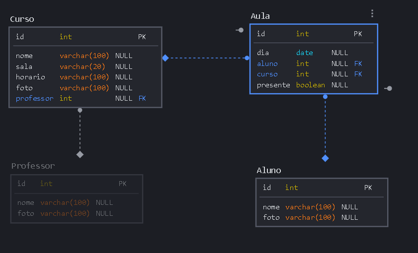
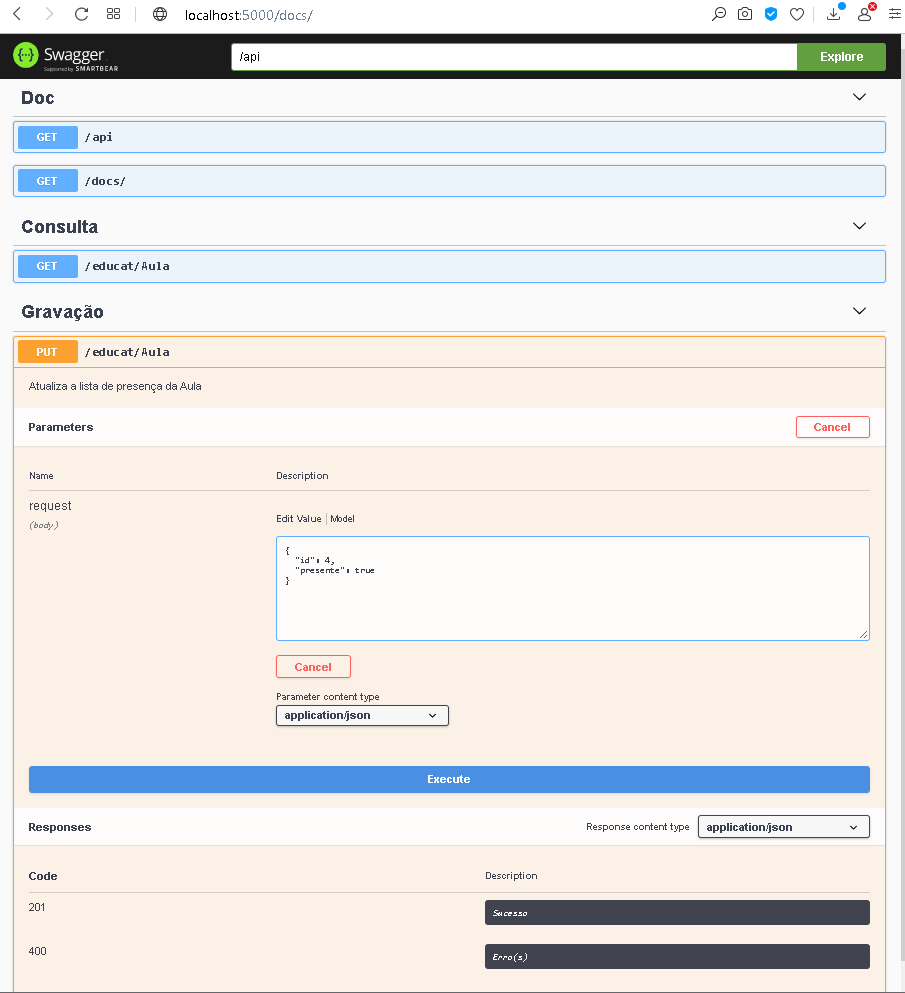
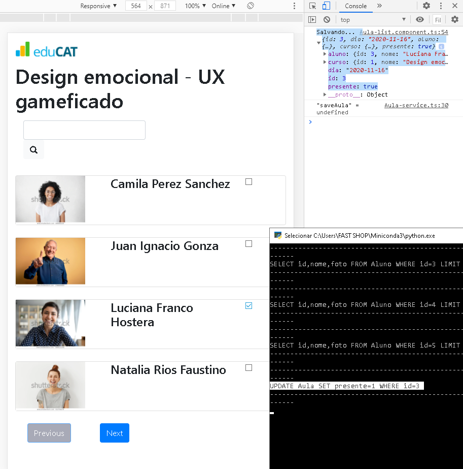

# Desafio Educat

##### Resolvido por: `Júlio Cascalles`

```
Este projeto representa um sistema para controle de presença de alunos em aulas.
```

---
## Back-end

* ### Banco de dados
    * Esta API pode rodar tanto com MySql como com Sqlite...
    * Variáveis de ambiente (para usar com MySql)
        - EDUCAT_USER
        - EDUCAT_HOST
        - EDUCAT_PASSWORD
    * Tabelas

* ### Como rodar:
    * Configure as variáveis de ambiente no seu sistema operacional. 
        - `SET EDUCAT_USER=root`
        - `SET EDUCAT_HOST=localhost`
        - `SET EDUCAT_PASSWORD=xyz1234`
    * Instale as dependências necessárias do Python, com...
        - `pip install -r requirements.txt`
    * Rode o back-end com...
        - `python app.py`
* ### Gerando dados iniciais
    >Por se tratar de um ambiente simulado (onde não existem dados de Alunos, Professores e Cursos), sempre que a consulta estiver vazia, o diretório de imagens será varrido e registros equivalentes serão gerados no banco de dados.
* ### Testes unitários
    * Foram testados as seguintes situações:
        - Consulta, bem sucedida, de Aula;
        - Falha na consulta de Aula.
        - Atualização da lista de presença;
        - Falha na atualização da lista.


---

## Documentação Swagger
A documentação é gerada automaticamente varrendo-se os endpoints e docstrings declados no código -- Portanto se o código for alterado, o swagger irá refletir isso, sem necessidade de intervenção.
* ### A estrutura de dados é extraída diretamente da modelagem (ver pasta `/model` do backend)



---
## Front-end
* ### Como rodar:
    - O front-end foi feito em _Angular_ 9
    - É preciso instalar as dependências com `YARN` (ou **npm install**)
    - O comando para rodar localmente é:
        - `ng serve --open --proxy-config proxy.conf.json`

* ### Componentes
    * Aula-List: Lista de alunos inscritos na aula;
    * Aula-Item: Representa cada registro do aluno, com nome, foto...
    * Navigator: Permite navegar entre páginas de dados, quando não couber na página atual
    > A título de exemplo, delimitei em 4 alunos por página, mas esse valor pode facilmente ser alterado em 
    >>**_Aula-list.component.html_** editando a linha `[maxItems]="4"`
    * Search Bar: Permite filtrar somente os nomes de alunos que contenham o que foi digitado na barra.
    


* ### Editando a lista de presença
Ao lado de cada aluno há um checkbox -- Sempre que o professor clicar no checkbox, o estado do aluno é alterado na aula:

