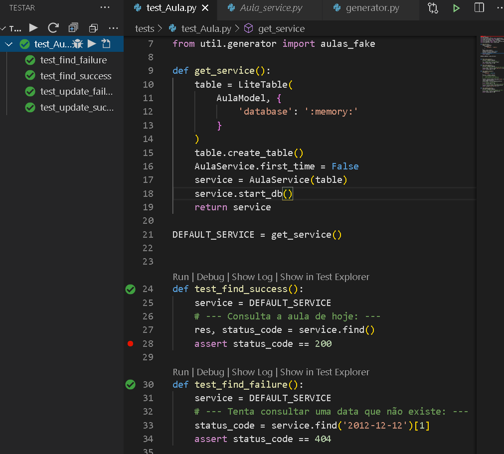

# Desafio Educat

##### Resolvido por: `Júlio Cascalles`

---
## Back-end

* ### Banco de dados
    * Esta API pode rodar tanto com MySql como com Sqlite...
    * Variáveis de ambiente (para usar com MySql)
        - EDUCAT_USER
        - EDUCAT_HOST
        - EDUCAT_PASSWORD
* ### Gerando dados iniciais
    * Aula atual
    * Curso
    * Professor
    * Aluno
* ### Testes unitários
    * Foram testados as seguintes situações:
        - Consulta, bem sucedida, de Aula;
        - Falha na consulta de Aula.
        - Atualização da lista de presença;
        - Falha na atualização da lista.

---
## Front-end

* ### Componentes
    * Aula-List
    * Aula-Item
    * Navigator
    * Search Bar ...

